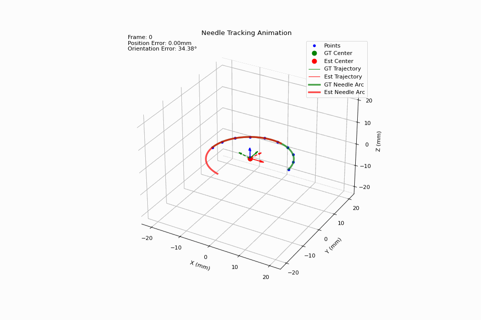

# Ellipse Pose Estimator

This project implements an **Ellipse Pose Estimator** that estimates the **3D pose** (position + orientation) of an ellipse from a set of noisy or ideal 3D points sampled along its edge.

The core idea is to:

* Fit a plane to the 3D points using PCA.
* Project the points onto the plane.
* Fit a 2D ellipse using robust least squares.
* Recover the 3D pose (center + rotation matrix) of the original ellipse in space.

Useful for pose estimation in medical tools, robotics, and any system involving 3D ellipses (e.g. needles, rings, or camera calibration targets).

###  Main Features

* Robust 3D plane fitting via PCA
* Ellipse fitting using non-linear least squares with Huber loss
* Pose extraction as rotation matrix + position vector
* Visualization of orientation, plane, and fitting error

###  Dependencies

* `numpy`
* `scipy`
* `sklearn`
* `matplotlib`
* `NeedleHelperFunctions` (local module, e.g. `EllipseTransformer`, `EllipseVisualizer`)

